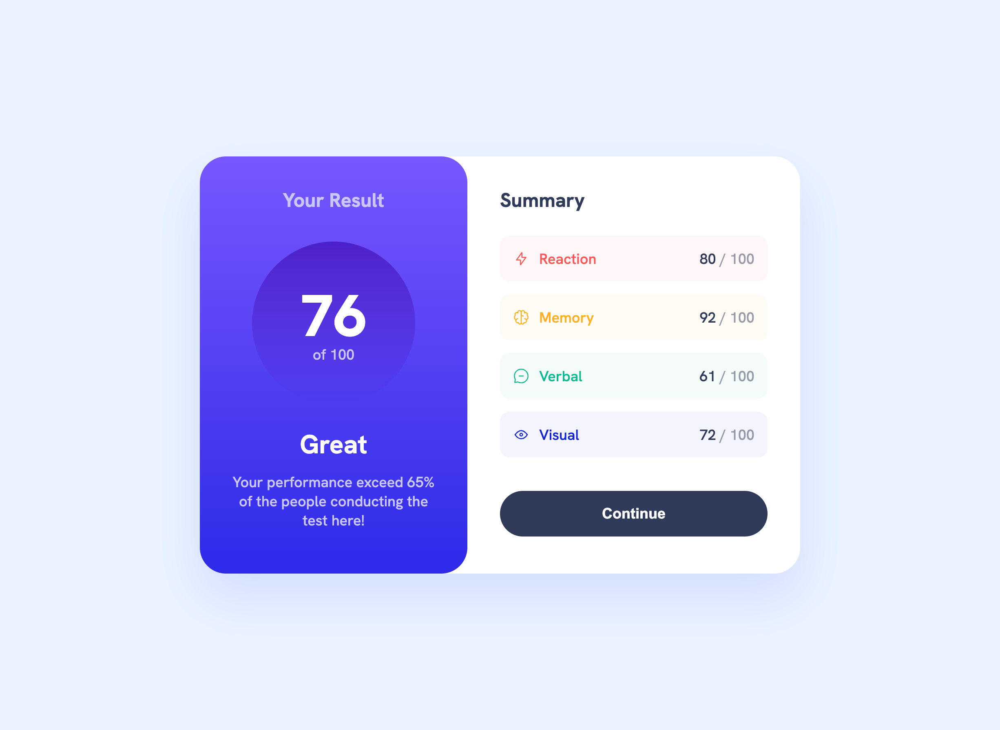
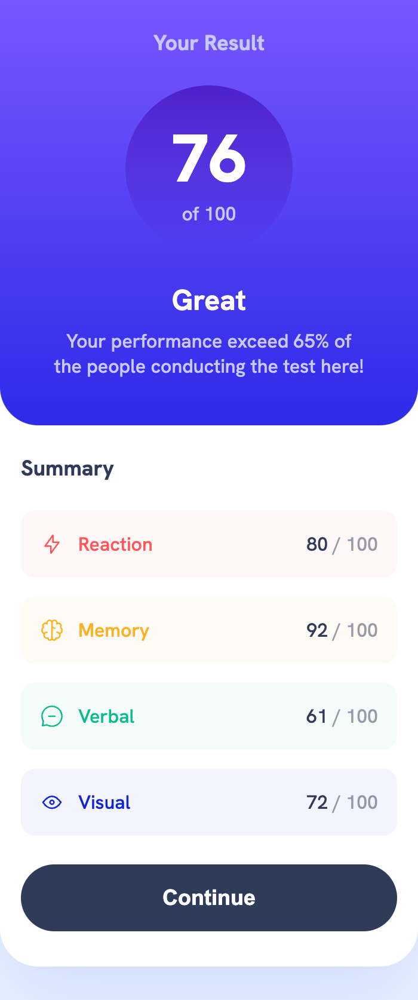

# Frontend Mentor - Results summary component solution

This is a solution to the [Results summary component challenge on Frontend Mentor](https://www.frontendmentor.io/challenges/results-summary-component-CE_K6s0maV). Frontend Mentor challenges help you improve your coding skills by building realistic projects.

## Table of contents

- [Overview](#overview)
  - [The challenge](#the-challenge)
  - [Screenshot](#screenshots)
  - [Links](#links)
- [My process](#my-process)
  - [Built with](#built-with)
  - [What I learned](#what-i-learned)
  - [Continued development](#continued-development)
  - [Useful resources](#useful-resources)
- [Author](#author)
- [Acknowledgments](#acknowledgments)

## Overview

### The challenge

Users should be able to:

- View the optimal layout for the interface depending on their device's screen size
- See hover and focus states for all interactive elements on the page
- Use the local JSON data to dynamically populate the content

### Screenshots

### Links

- Solution URL: [GitHub](https://github.com/maliabadziukh/results-summary-component)
- Live Site URL: [GitHub Pages](https://maliabadziukh.github.io/results-summary-component/)

## My process

### Built with

- HTML & CSS
- Vanilla JS

### What I learned

This was great practice for using flexbox as the main layout tool. I also don't often work with vanilla CSS so it was interesting to manually write everything out instead of, for example, using tailwind utility classes.
It was nice to work with breakpoints and really pay attention to which properties should change at breakpoints and which ones can stay the same.

I normally work with angular so it was a learning point for me to figure out how to dynamically add HTML elements to the DOM via JS based on the data from the JSON file in the project directory.

### Continued development

It would be interesting to recreate the same component with Angular and Tailwind to see what the differences in the development process are and what are the benefits and downsides of each method.

## Author

- Frontend Mentor - [@maliabadziukh](https://www.frontendmentor.io/profile/maliabadziukh)
- LinkedIn - [in/maliabadziukh](https://www.linkedin.com/in/maliabadziukh/)
